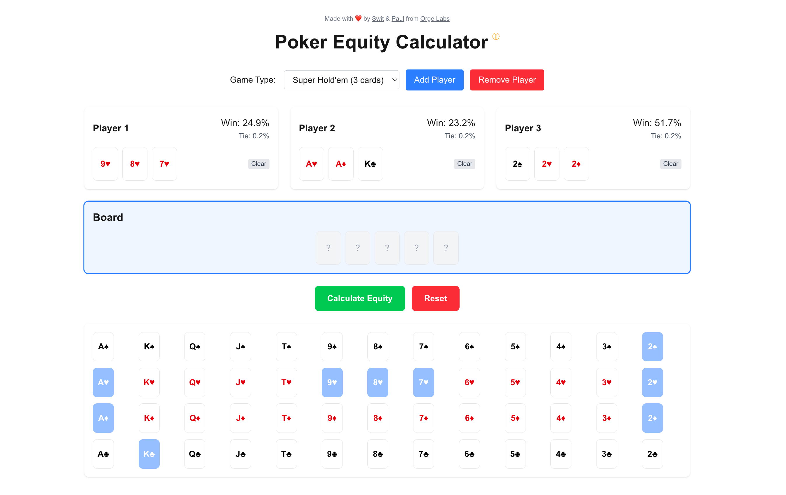

# Poker Equity Calculator

A fast, accurate, and mobile-friendly poker hand equity calculator for Texas Hold'em, Omaha, and Super Hold'em games. Calculate win percentages for multiple players in real-time.



## 🎮 Features

- **Multiple Game Types**: Support for Texas Hold'em, Omaha Hold'em, and Super Hold'em (3-card)
- **Real-time Equity Calculation**: Instantly see win and tie percentages
- **Mobile-Friendly**: Responsive design works on desktop and mobile devices
- **Multi-player Support**: Calculate equity for up to 6 players
- **Fast Performance**: Uses Monte Carlo simulation with random runouts for speed and accuracy
- **Intuitive UI**: Easy-to-use card selector and clear visual presentation
- **Progressive Web App**: Can be installed on mobile devices for offline use

## 🚀 Live Demo

Visit [https://poker-calculator.orge.xyz](https://poker-calculator.orge.xyz) to use the calculator.

## 🔧 Technologies Used

- **Frontend**: Next.js 15 with React 19
- **Styling**: Tailwind CSS 4
- **State Management**: React Hooks
- **Poker Engine**: pokersolver for hand evaluation
- **Build Tool**: Turbopack for fast development
- **Typography**: Geist font family
- **Deployment**: Vercel

## 📝 How to Use

1. **Select Game Type**: Choose between Texas Hold'em, Omaha Hold'em, or Super Hold'em
2. **Add Players**: By default, the calculator starts with 2 players, but you can add up to 6
3. **Select Cards**: Click on a player or the board to activate it, then select cards from the card picker
4. **Calculate Equity**: Once all player hands and (optionally) the board are set, click "Calculate Equity"
5. **View Results**: See each player's winning percentage and tie percentage
6. **Reset or Clear**: Use the reset button to start over, or the clear buttons to remove cards from specific players or the board

## 💻 Development

This project is built with Next.js and uses Turbopack for development.

### Prerequisites

- Node.js 20+
- npm or yarn

### Installation

```bash
# Clone the repository
git clone https://github.com/yourusername/poker-equity-calculator.git
cd poker-equity-calculator

# Install dependencies
npm install
# or
yarn install

# Run the development server
npm run dev
# or
yarn dev
```

Open [http://localhost:3000](http://localhost:3000) with your browser to see the calculator.

### Building for Production

```bash
# Build the application
npm run build
# or
yarn build

# Start the production server
npm run start
# or
yarn start
```

## 📱 Mobile Experience

The calculator is designed to work well on mobile devices. It features:

- Responsive layout that adapts to screen size
- Touch-friendly card selection
- PWA support for installation on home screen
- Optimized performance even on lower-powered devices

## ⚙️ Technical Details

### Equity Calculation

The equity calculator uses different methods depending on the situation:

- For 1-2 cards remaining: Uses exact calculations by iterating through all possible combinations
- For 3+ cards remaining: Uses Monte Carlo simulation with random runouts for speed and accuracy

### Game Types

- **Texas Hold'em**: 2 hole cards per player, 5 community cards
- **Super Hold'em**: 3 hole cards per player, 5 community cards
- **Omaha Hold'em**: 4 hole cards per player (must use exactly 2), 5 community cards

## 👥 Credits

Made with ❤️ by [Swit](https://twitter.com/nomorebear) & [Paul](https://twitter.com/PNattapatsiri) from [Orge Labs](https://orge.xyz/)

## 📄 License

This project is licensed under the MIT License - see the LICENSE file for details.
